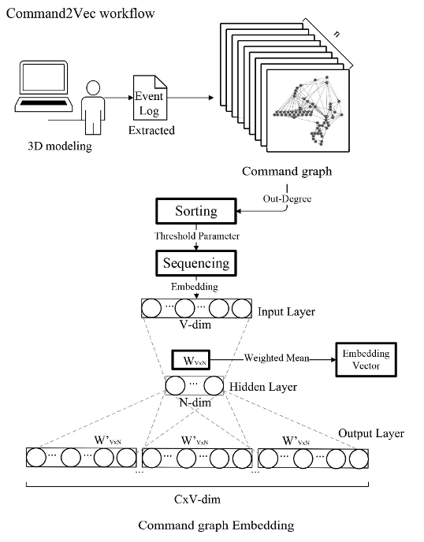

Command2Vec
=========================


### Abstract

<p align="justify">Command2Vec is an embedding algorithm designed for clustering 3D modeling behavior sequences in design industries. Its input data is originally extracted from Command-object graph which is a data structure retrieved from event logs generated during modeler’s 3D modeling process. Command graph can represent the modeler’s operational 'map' during the modeling process. Command2Vec is applied in a study of 112 participants modeling on a 'spiral stair' task. By extracting the event log generated in each participant’s modeling process into command graph, we classified their behavior sequences into certain groups using Command2Vec. To verify the effectiveness of our classification, we use external evaluation by inviting experts with extensive modeling experience to grade the classification results. The final grading show that our algorithm performs well in some clustering results that were with significant features.</p>

<div align=center></div>

<p align="justify">This repository provides an implementation for Command2vec in:</p>
Paper link


### Requirements

<p align="justify">The codebase is implemented in Python 2.7.18 | Anaconda3 (Python 3.8.5 64-bit). Package used for development are just below.</p>
```
numpy             
gensim           
matplotlib        
sklearn
```

### Datasets:
<p align="justify">The code takes two input folders('edges' and 'nodes') with txt files. </p>

<p align="justify">Every file in folder 'edges' is a set of edges of a graph and files have a numeric index as a name. The structure of the file is as follows</p>
```
start-point-number end-point-number
```

<p align="justify">Every file in folder 'nodes' is a set of nodes of a graph and files have a numeric index as a name. The index of edge file and node file of the same graph is the same. The structure of the file is as follows</p>
```
the-point-number binary-form-of-the-number corresponding-command-name
```
<p align="justify">The dataset used in the paper is in the folders 'edges' and 'nodes'</p>
### Options:
<p align="justify">Learning of the command-graph embedding is handled by the `./Command2Vec.py` script which provides the following command line arguments</p>

#### Input and output options
```
  --edgeslist   STR    Input edges-list folder       Default is `edges`.
  --nodeslist   STR    Input nodes-list folder       Default is `nodes`.
  --output      STR    Save output-results folder    Default is `emb`.
```
#### Model options
```
  --theta          INT          The theta used to select command sequence.        Default is 7.
  --dimensions     INT          Number of dimensions.                             Default is 128.
  --window-size    INT          Context size for optimization.                    Default is 4
  --iter           INT          Number of feature extraction recursions.          Default is 10000.
  --workers        INT          Number of workers.                                Default is 8.
```
### Examples:
<p align="justify">The following commands learn an embedding of the command-graphs and write it to disk. The code will save the key command extraction results of each command-graph, the embedding of each command and the embedding of the whole command-graph in the output folder. For the file that saves the embedding results of the whole command-graph, each line represents the embedding of a command-graph. The line index corresponds to the index of the input file</p>

<p align="justify">Creating a command2vec embedding of the default dataset with the default hyperparameter settings. Saving the embedding at the default path.</p>
```sh
$ python Command2Vec.py
```

<p align="justify">Creating an embedding of an other dataset. Saving the output in a custom place.</p>

```sh
$ python Command2Vec.py --input-path new_data/ --output-path new_save_path/
```

<p align="justify">Creating an embedding of the default dataset in 32 dimensions.</p>

```sh
$ python Command2Vec.py --dimensions 32
```

<p align="justify">Finally, when you want to cluster the embedding results, you need to modify the input and output file path in `cluster.py` script, and then run the following command</p>
```sh
$ python cluster.py
```

### Project description
```
  Command2Vec.py    The script of creating embedding of the command-graphs
  cluster.py        The script for clustering analysis of embedding results
  edges, nodes      The default input folder
  emb               The default output folder
  cluster           The default folder saving the cluster results
```


